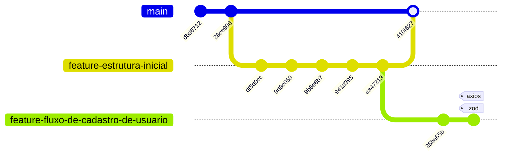

# Welcome App BiCity 👋



<link rel="stylesheet" href="https://cdnjs.cloudflare.com/ajax/libs/font-awesome/6.1.0/css/all.min.css">
<h1 align="center">
  
</h1>

# PI1A5/PI2A6 - Projeto Integrado I e II - App BiCity

## Informações Gerais

<!-- Informações do curso e professor -->

<table>
  <tr>
    <td style="width: 50%; vertical-align: top; padding: 10px;">
   Trabalho apresentado nas disciplinas PI1A5 - Projeto Integrado I (2024) e PI2A6 - Projeto Integrado I (2025), do curso Superior de Tecnologia em
Análise e Desenvolvimento de Sistemas do Instituto Federal de Educação, Ciência e Tecnologia de São Paulo.<br><br>
Orientadores: Prof. Bernardo e Prof. Palladino (PI1A5 - 2024).<br><br>
Orientadores: Prof. Palladino e Prof. Quirino (PI2A6 - 2025).
    </td>
    <td>
      <table>
        <tr>
          <td>
            <br>
            <strong>Prof. Bernardo</strong>
          </td>
          <td>
            <br>
            <strong>Prof. Palladino</strong>
          </td>
        </tr>
        <tr>
          <td colspan="2">
            <br>
            <strong>Prof. Quirino</strong>
          </td>
        </tr>
      </table>
    </td>
  </tr>
</table>

<!-- Redirecionamento de para redes sociais com Icones -->
<table>
  <tr>
    <td>
      <strong>Orientador: Prof. Bernardo</strong><br><br>
      <a href="https://www.linkedin.com/in/domingos-bernardo-487b837/" target="_blank">
        
      </a>
      <a href="https://github.com/bernardo" target="_blank">
        
      </a>
    </td>
    <td>
      <strong>Orientador: Prof. Palladino</strong><br><br>
      <a href="https://www.linkedin.com/in/palladino-antonio-a-aa2897b7/" target="_blank">
        
      </a>
      <a href="https://github.com/palladino" target="_blank">
        
      </a>
    </td>
    <td>
      <strong>Orientador: Prof. Quirino</strong><br><br>
      <a href="https://www.linkedin.com/in/luizfpq/" target="_blank">
        
      </a>
      <a href="https://github.com/quirino" target="_blank">
        
      </a>
    </td>
  </tr>
</table></br>
</br>
<!--****************************************************************************************************************-->
<!-- Informações do Aluno -->

# Contributors ✨

Thanks goes to these wonderful people:

<!-- ALL-CONTRIBUTORS-LIST:START - Do not remove or modify this section -->
<!-- prettier-ignore-start -->
<!-- markdownlint-disable -->
<table align="center">
  <tr>
    <tr>
   <td align="center"><a href="https://github.com/CaioARL"><br/><sub><b>Caio Arruda</b></sub></a><br /><a href="https://github.com/CaioARL" title="GitHub"></a><a href="#" title="Linkedin"></a></td>
    <td align="center"><a href="https://github.com/GabrielAlvesGit"><br/><sub><b>Gabriel Josué</b></sub></a><br /><a href="https://github.com/GabrielAlvesGit" title="GitHub"></a><a href="https://www.linkedin.com/in/gabrielalv3s/" title="Linkedin"></a></td>
        <td align="center"><a href="https://github.com/gabuh"><br/><sub><b>Gabriel Nogueira</b></sub></a><br /><a href="https://github.com/gabuh" title="GitHub"></a><a href="https://www.linkedin.com/in/gabunogueira" title="Linkedin"></a></td>
    <td align="center"><a href="https://github.com/luizatempobono"><br/><sub><b>Luiza Tempobono</b></sub></a><br /><a href="https://github.com/luizatempobono" title="GitHub"></a><a href="https://br.linkedin.com/in/luizatempobono" title="Linkedin"></a></td>
    <td align="center"><a href="https://github.com/c0zyhug"><br/><sub><b>Kayan Garbi</b></sub></a><br /><a href="https://github.com/c0zyhug" title="GitHub"></a><a href="https://www.linkedin.com/in/kayan-garbi/" title="Linkedin"></a></td> 
  </tr>
</table>


<!-- Tecnologias utilizadas no projeto -->

## Tecnologias

<div align="center">
    
    
    
    
    
    
    
    
    
    
    
    
</div>

## Descrição do Projeto

<p>
Este projeto, desenvolvido na disciplina de PI1A5 - Projeto Integrado I,<br> 
Este é desafio de programação proposto pela BiCity A ideia é basicamente a seguinte:

O presente projeto tem como objetivo criar um aplicativo que permita aos usuários avaliar as ciclovias da cidade de São Paulo, permitindo identificar as mais próximas, relatar problemas na via e acompanhar eventos relacionados ao ciclismo, ajudando a melhorar a experiência e segurança dos ciclistas na cidade.

**Devem ser feitos:**

- Uso do Trello para organização do projeto
  - Criar e gerenciar tarefas, bugs e histórias de usuário.
  - Estabelecer um fluxo de trabalho claro com sprints e backlog.
  - Acompanhar o progresso do projeto e realizar reuniões de revisão.
-   Documentação
    - Elaborar documentação técnica detalhada, incluindo arquitetura do sistema, APIs e fluxos de dados.
-   Aplicação do Projeto
    - Desenvolver a aplicação utilizando as tecnologias definidas (React Expo, Java e etc.).
    - Implementar funcionalidades de forma incremental, garantindo testes e validações em cada etapa.
    - Testes e Validações.
-   Apresentação do Projeto
    - Apresentação objetiva e concisa que destaque os objetivos, funcionalidades e resultados do projeto.
    - Demonstrações práticas do aplicativo em funcionamento.
</p>

## 🔎 Instruções de Como usar

1. Certifique-se de ter o Node.js(Node.js (versão recomendada: >=16.0.0/ expo >=52.0)) e React Expo instalado
    ```
    Link: https://docs.npmjs.com/downloading-and-installing-node-js-and-npm
    Link: https://docs.expo.dev/
    ```
    
2. Clone o repository
    ```
    $ git clone https://github.com/CaioARL/BiCity
    $ cd bi-city
     ```
    
3. Instalação das dependências
    ```
    $ npm install
    $ # ou
    $ yarn install
   ```

4. Instalar dependências específicas
    ```bash
    npm install react-native-maps
    expo install expo-location
    npm install geojson - Caso necessario
    ```
    
 5. Start the app
    ```bash
     npx expo start
    ```

## Criar nova branch

1. Crie a nova branch

    ```
     Lembre de manter o padrão "feature-"
     git checkout -b feature-nome-que-voce-vai-add
    ```

2. No VSCode, no canto inferior esquerdo, você verá a branch atual em que está trabalhando. Verifique se ela mostra o nome correto da nova branch, por exemplo:

    ```
      feature-filtro-do-mapa
    ```

3. Adicione as alterações

    ```
      git add .
    ```

4. Faça o commit com a mensagem adequada

    ```
     git commit -m "Adiciona funcionalidade...."
    ```

5. Empurre a nova branch para o repositório remoto

    ```
      git push origin feature-nome-que-voce-vai-add
    ```

## Documentação

<a href="https://www.figma.com/design/KCeLjQD4pfOAC88nYXWICV/Projeto-PI1A5---Grupo-5?node-id=0-1&t=SuQxY3qDCQvJZxQ2-1">Documentação Figma </a>

<a href="https://github.com/user-attachments/files/20956726/PI2A6.-.BiCity.Documentacao.pdf">Documentação Doc. </a>

<a href="https://trello.com/b/k4kDjjbt/novo-projeto">Trello </a>

```diff
- 🚨 Aviso Importante 🚨
```
**Este repositório não contém o código-fonte do aplicativo.** Ele serve apenas como um espelho do projeto,
reunindo informações sobre o desenvolvimento e a direção do app.

Por questões de desenvolvimento e outros motivos, o código não está disponível publicamente.
No entanto, o projeto já está **99% concluído**, incluindo **frontend**,
**backend**, **banco de dados** e **serviços AWS**.


## 💻 Layout BiCity

https://github.com/user-attachments/assets/8dbae452-adc7-4b85-827c-1880f0d70aa1


