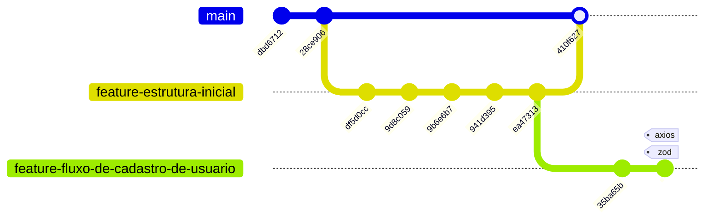

# Welcome to your Expo app BiCity 👋

This is an [Expo](https://expo.dev) project created with [`create-expo-app`](https://www.npmjs.com/package/create-expo-app).



<link rel="stylesheet" href="https://cdnjs.cloudflare.com/ajax/libs/font-awesome/6.1.0/css/all.min.css">
<h1 align="center">
  
</h1>

# PI1A5 - Projeto Integrado I - BiCity

## Informações Gerais

<!-- Informações do curso e professor -->
<div align="left"> 
<p>Trabalho apresentado na matéria de  PI1A5 - Projeto Integrado I
                do curso Superior de Tecnologia em Análise e
                Desenvolvimento de Sistemas do Instituto Federal de
                Educação, Ciência e Tecnologia de São Paulo.<br>
                Orientador: Prof.Bernardo e Prof.Palladino
        </p>
<!-- Redirecionamento de para redes sociais com Icones -->
 <div>
  Orientador: Prof.Bernardo:<br>   
  <a  href="https://www.linkedin.com/in/domingos-bernardo-487b837/?originalSubdomain=br" target="_blank"></a> 
  <a href="https://www.linkedin.com/in/domingos-bernardo-487b837/?originalSubdomain=br" target="_blank"></a><br><br>
  Orientador: Prof.Palladino:<br>   
  <a href="https://www.linkedin.com/in/palladino-antonio-a-aa2897b7/?originalSubdomain=br" target="_blank"></a> 
  <a href="https://www.linkedin.com/in/palladino-antonio-a-aa2897b7/?originalSubdomain=br" target="_blank"></a>
</div>
</div></br>
</br>
<!--****************************************************************************************************************-->
<!-- Informações do Aluno -->

# Contributors ✨

Thanks goes to these wonderful people:

<!-- ALL-CONTRIBUTORS-LIST:START - Do not remove or modify this section -->
<!-- prettier-ignore-start -->
<!-- markdownlint-disable -->
<table align="center">
  <tr>
    <tr>
   <td align="center"><a href="https://github.com/CaioARL"><br/><sub><b>Caio Arruda</b></sub></a><br /><a href="https://github.com/CaioARL" title="GitHub"></a><a href="#" title="Linkedin"></a></td>
    <td align="center"><a href="https://github.com/GabrielAlvesGit"><br/><sub><b>Gabriel Josué</b></sub></a><br /><a href="https://github.com/GabrielAlvesGit" title="GitHub"></a><a href="https://www.linkedin.com/in/gabrielalv3s/" title="Linkedin"></a></td>
        <td align="center"><a href="https://github.com/gabuh"><br/><sub><b>Gabriel Nogueira</b></sub></a><br /><a href="https://github.com/gabuh" title="GitHub"></a><a href="https://www.linkedin.com/in/gabunogueira" title="Linkedin"></a></td>
    <td align="center"><a href="https://github.com/luizatempobono"><br/><sub><b>Luiza Tempobono</b></sub></a><br /><a href="https://github.com/luizatempobono" title="GitHub"></a><a href="https://br.linkedin.com/in/luizatempobono" title="Linkedin"></a></td>
    <td align="center"><a href="https://github.com/c0zyhug"><br/><sub><b>Kayan Garbi</b></sub></a><br /><a href="https://github.com/c0zyhug" title="GitHub"></a><a href="https://www.linkedin.com/in/kayan-garbi/" title="Linkedin"></a></td> 
  </tr>
</table>


<!-- Tecnologias utilizadas no projeto -->

## Tecnologias

<div align="center">
    
    
    
    
    
    
    
    
    
    
    
    
</div>

## Descrição do Projeto

<p>
Este projeto, desenvolvido na disciplina de PI1A5 - Projeto Integrado I,<br> 
Este é desafio de programação proposto pela BiCity A ideia é basicamente a seguinte:

O presente projeto tem como objetivo criar um aplicativo que permita aos usuários avaliar as ciclovias da cidade de São Paulo, permitindo identificar as mais próximas, relatar problemas na via e acompanhar eventos relacionados ao ciclismo, ajudando a melhorar a experiência e segurança dos ciclistas na cidade.

**Devem ser feitos:**

- Uso do Trello para organização do projeto
  - Criar e gerenciar tarefas, bugs e histórias de usuário.
  - Estabelecer um fluxo de trabalho claro com sprints e backlog.
  - Acompanhar o progresso do projeto e realizar reuniões de revisão.
-   Documentação
    - Elaborar documentação técnica detalhada, incluindo arquitetura do sistema, APIs e fluxos de dados.
-   Aplicação do Projeto
    - Desenvolver a aplicação utilizando as tecnologias definidas (React Expo, Java e etc.).
    - Implementar funcionalidades de forma incremental, garantindo testes e validações em cada etapa.
    - Testes e Validações
-   Apresentação do Projeto
    - Apresentação clara e concisa que destaque os objetivos, funcionalidades e resultados do projeto.
    - Demonstrações práticas do aplicativo em funcionamento.
</p>

## 🔎 Instruções de Como usar

1. Certifique-se de ter o Node.js(Node.js (versão recomendada: >=16.0.0)) e React Expo instalado
    ```
    Link: https://docs.npmjs.com/downloading-and-installing-node-js-and-npm
    Link: https://docs.expo.dev/
    ```
    
2. Clone o repository
    ```
    $ git clone https://github.com/....
    $ cd bi-city
     ```
    
3. Instalação das dependências
    ```
    $ npm install
    $ # ou
    $ yarn install
   ```

4. Instalar dependências específicas
    ```bash
    npm install react-native-maps
    expo install expo-location
    npm install geojson - Caso necessario
    ```
    
 5. Start the app
    ```bash
     npx expo start
    ```

## Create new branch

1. Crie a nova branch

    ```
     Lembre de manter o padrão "feature-"
     git checkout -b feature-nome-que-voce-vai-add
    ```

2. No VSCode, no canto inferior esquerdo, você verá a branch atual em que está trabalhando. Verifique se ela mostra o nome correto da nova branch, por exemplo:

    ```
      feature-filtro-do-mapa
    ```

3. Adicione as alterações

    ```
      git add .
    ```

4. Faça o commit com a mensagem adequada

    ```
     git commit -m "Adiciona funcionalidade...."
    ```

5. Empurre a nova branch para o repositório remoto

    ```
      git push origin feature-nome-que-voce-vai-add
    ```

In the output, you'll find options to open the app in a

-   [development build](https://docs.expo.dev/develop/development-builds/introduction/)
-   [Android emulator](https://docs.expo.dev/workflow/android-studio-emulator/)
-   [Alternativa para a instalação do Android emulator](https://www.youtube.com/watch?v=dNhHv4JzsTw)
-   [iOS simulator](https://docs.expo.dev/workflow/ios-simulator/)
-   [Expo Go](https://expo.dev/go), a limited sandbox for trying out app development with Expo

You can start developing by editing the files inside the **app** directory. This project uses [file-based routing](https://docs.expo.dev/router/introduction).

## Get a fresh project

When you're ready, run:

```bash
npm run reset-project
```

This command will move the starter code to the **app-example** directory and create a blank **app** directory where you can start developing.

## Learn more

To learn more about developing your project with Expo, look at the following resources:

-   [Expo documentation](https://docs.expo.dev/): Learn fundamentals, or go into advanced topics with our [guides](https://docs.expo.dev/guides).
-   [Learn Expo tutorial](https://docs.expo.dev/tutorial/introduction/): Follow a step-by-step tutorial where you'll create a project that runs on Android, iOS, and the web.


## Documentações

<a href="https://www.figma.com/design/KCeLjQD4pfOAC88nYXWICV/Projeto-PI1A5---Grupo-5?node-id=0-1&t=SuQxY3qDCQvJZxQ2-1">Documentação Figma </a>

<a href="#">Documentação Doc. </a>

<a href="https://trello.com/b/k4kDjjbt/novo-projeto">Trello </a>


```diff
- 🚨 Aviso Importante 🚨

**Este repositório não contém o código-fonte do aplicativo.** Ele serve apenas como um espelho do projeto,
reunindo informações sobre o desenvolvimento e a direção do app.

Por questões de desenvolvimento e outros motivos, o código não está disponível publicamente.
No entanto, o projeto já está **80% concluído**, incluindo **frontend**, **backend**, **banco de dados** e **serviços AWS**.
```
The background color is `#ffffff` for light mode and `#000000` for dark mode.

## 💻 Layout BiCity

<div style="display: flex; justify-content: center;">
   
   
   
       
   
     
</div>
